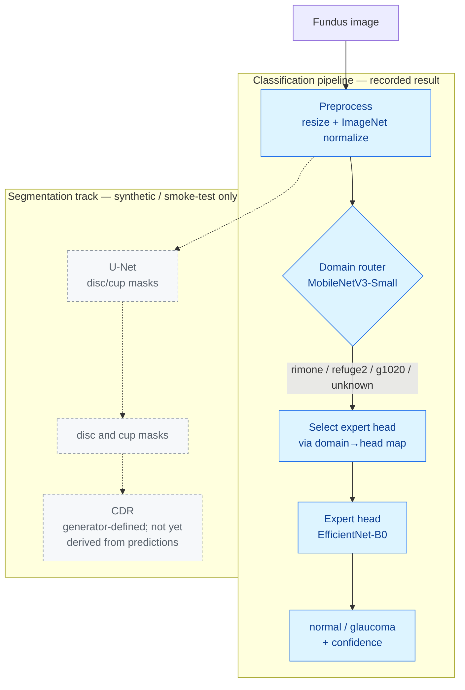
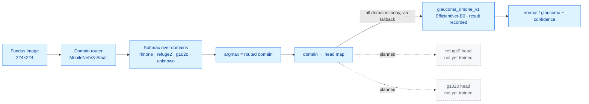

# AcuVue

AcuVue classifies retinal fundus photographs as normal or glaucoma. One image
goes in; a small domain router picks a dataset-specific expert model, and that
model returns the prediction with a confidence score. Alongside it sits an
earlier-stage track for optic disc and cup segmentation — the structures the
cup-to-disc ratio (CDR) is measured from.

> **Status:** research / educational software. Not a medical device, not
> validated for clinical use, and it carries no regulatory clearance. The numbers
> below come from public-dataset experiments, not prospective clinical
> validation. See [Limitations](#limitations).

---

## Summary

| | |
|---|---|
| **Input** | One RGB fundus image (any common format; resized to 224×224 for classification, 512×512 for segmentation) |
| **Primary output** | Binary class `normal` / `glaucoma` + confidence, plus the routed domain and the expert head used |
| **Segmentation output** | Optic-disc and optic-cup masks (U-Net); CDR is defined by these masks (see below) |
| **Models** | EfficientNet-B0 glaucoma classifier · MobileNetV3-Small domain router · 3-level U-Net (disc/cup) |
| **Architecture research track** | Backbone grammar (EfficientNet / ConvNeXt / DeiT) × fusion modules (FiLM / cross-attention / gated / late) for image + clinical-indicator fusion |
| **Recorded result** | Test AUC 0.937 — glaucoma classification, EfficientNet-B0, RIM-ONE only (485 images), hospital-based split (details below) |
| **Config** | Hydra / OmegaConf YAML |
| **Trained weights** | Not committed; no download URL configured yet — see [Pretrained inference](#pretrained-inference) |

Only the classification pipeline has a recorded result behind it. The
segmentation track runs on synthetic and smoke-test data for now, with no
measured accuracy.

---

## System overview



The solid path is the domain-routed classifier, the part with a recorded test
result. The dashed path is the disc/cup segmentation track, which hasn't been past
synthetic and dummy data. Preprocessing is shared; the router and expert
head are separate models. Only one expert head is trained today (RIM-ONE), so
every domain routes to it — see
[Domain routing](#domain-routing-and-multi-head-architecture).

---

## The medical-imaging task

Glaucoma enlarges the optic cup relative to the optic disc. The vertical
cup-to-disc ratio (CDR) — cup vertical diameter over disc vertical diameter — is
a standard structural marker: lower in healthy eyes, higher in glaucomatous ones.


*Vertical CDR drawn as a schematic — illustrative geometry, not a model output or
a real image. AcuVue attacks the problem from two directions: classify `normal`
vs `glaucoma` straight from the image, and segment the disc and cup that CDR is
measured from.*

The segmentation model emits disc and cup masks, and the synthetic generator
fixes a CDR when it builds an example. Nothing in the pipeline computes CDR from a
*predicted* mask yet, so CDR is not a real output today.

---

## End-to-end workflow

Inference, the recorded classification path:

1. Load a fundus image.
2. Preprocess — resize to 224×224, ImageNet normalization.
3. The domain router (MobileNetV3-Small) predicts the source domain: `rimone`,
   `refuge2`, `g1020`, or `unknown`.
4. The pipeline maps that domain to an expert head and loads it, falling back to
   the default head if the mapped one isn't available.
5. The expert head (EfficientNet-B0) returns `normal` / `glaucoma` with a
   confidence score.
6. The result carries the prediction, the class probabilities, the routed domain,
   and which head ran.

Segmentation is separate. A 3-level U-Net takes a 512×512 image and produces a
disc/cup mask (sigmoid output), trained with BCE + Dice. So far it has only run on
synthetic fundus images and dummy smoke-test data.

---

## Prediction example

You can generate a synthetic demonstration of the segmentation target locally —
original fundus, disc mask, cup mask, overlay, and the resulting vertical CDR. No
downloads, no GPU, no trained weights:

```bash
python scripts/visualization/generate_segmentation_demo.py --seed 42
# -> docs/images/segmentation-demo.png
```

There is no real end-to-end prediction figure (fundus → predicted masks / class →
ground truth), because neither the trained checkpoints nor the clinical images
are committed — see [Pretrained inference](#pretrained-inference) and
[Reproducibility levels](#reproducibility-levels).

---

## Results

The one result backed by a committed artifact is the production glaucoma
classifier:


| Metric | Value | Meaning |
|---|---:|---|
| **Test AUC** | **0.937** | Ranking quality, held-out test set |
| Test accuracy | 0.765 | Fraction correct |
| Test sensitivity (recall) | 0.744 | Glaucoma cases correctly flagged |
| Test specificity | 0.917 | Normal cases correctly cleared |
| Best validation AUC | 0.9875 | At epoch 29 of 30 |

This measures binary classification — `normal` vs `glaucoma` from the image — not
segmentation and not a CDR reading. The model is EfficientNet-B0 (timm),
ImageNet-pretrained, 224×224 input. It was trained and evaluated on RIM-ONE only,
485 images; this is not the combined 1,905-image set, and the run used no domain
adaptation.

The split is hospital-based. Training and validation come from hospitals `r2` and
`r3` (330 train, 57 val); the held-out test set is hospital `r1` (98 images), and
no hospital appears on both sides. That matters here. A random image-level split
on RIM-ONE reaches ~97% AUC by memorizing per-hospital acquisition signatures,
which is leakage. Splitting by hospital closes that shortcut, and 0.937 is what's
left. Background in
[`docs/HOSPITAL_BASED_SPLITTING.md`](docs/HOSPITAL_BASED_SPLITTING.md).

The numbers come from
[`models/production/training_history_v1.json`](models/production/training_history_v1.json)
(`test_metrics`), with dataset counts in
[`models/production/dataset_metadata_v1.json`](models/production/dataset_metadata_v1.json)
and the run configuration in
[`configs/production_training_v1.yaml`](configs/production_training_v1.yaml).

Treat this as a recorded historical result, not something you can rebuild from a
clean clone. The checkpoint isn't committed, no download URL is set, and RIM-ONE
has to be fetched and preprocessed separately. Regenerating it means retraining on
RIM-ONE, and only a single run is recorded — there is no repeated-seed variance.

There is no ROC curve because the artifact stores summary metrics, not per-sample
scores; a faithful ROC or confusion matrix can't be reconstructed from it.

No segmentation results are recorded. The Dice/IoU code exists
([`src/evaluation/metrics.py`](src/evaluation/metrics.py)), but only ever against
synthetic and dummy data, so nothing is committed.

---

## Domain routing and multi-head architecture



The router is a learned MobileNetV3-Small classifier (~2.5M params). It doesn't
diagnose anything — it predicts which dataset family (acquisition domain) an image
came from. The model defines four classes (`rimone`, `refuge2`, `g1020`,
`unknown`), and the training config
([`configs/router_training_v1.yaml`](configs/router_training_v1.yaml)) trains over
the three known ones.

Routing is hard: `argmax` over the softmax, then a static domain → head map
([`src/inference/head_registry.py`](src/inference/head_registry.py)) picks the
expert. If the mapped head isn't loaded, the pipeline falls back to the first one
available ([`src/inference/pipeline.py`](src/inference/pipeline.py)). For uncertain
cases there's an ensemble path (`predict_with_ensemble`) that averages
probabilities across heads.

In practice there is exactly one head registered — `glaucoma_rimone_v1`, the
RIM-ONE model — and every domain, `refuge2` and `g1020` included, currently falls
back to it. The per-domain heads are scaffolded as commented placeholders but
haven't been trained, and neither the router weights nor the head weights are
committed, so running the pipeline end to end means training or supplying them
first.

Design notes: [`docs/MULTI_HEAD_ARCHITECTURE.md`](docs/MULTI_HEAD_ARCHITECTURE.md).

---

## Model architecture and fusion strategies

Three model families live in the tree.

The glaucoma classifier is the production path: EfficientNet-B0 (timm),
ImageNet-pretrained, `Dropout(0.3) → Linear(1280, 2)`. It's the model behind the
0.937 result, wrapped for inference by `GlaucomaPredictor`
([`src/inference/predictor.py`](src/inference/predictor.py)).

Disc/cup segmentation is a compact 3-level U-Net with skip connections, sigmoid
mask output, BCE + Dice objective
([`src/models/unet_disc_cup.py`](src/models/unet_disc_cup.py)).

The third is an architecture-grammar research track. A model factory
([`src/models/model_factory.py`](src/models/model_factory.py)) pairs a backbone
with a fusion module to build a multimodal classifier that fuses image features
with clinical indicators:

| Backbones ([`backbones.py`](src/models/backbones.py)) | Fusion modules ([`fusion_modules.py`](src/models/fusion_modules.py)) |
|---|---|
| EfficientNet-B0…B7 | **FiLM** — feature-wise linear modulation |
| ConvNeXt Tiny / Small / Base | **Cross-attention** — clinical queries attend to image features |
| DeiT Tiny / Small / Base (ViT) | **Gated** — learned per-sample weighting |
| | **Late** — pooled concatenation baseline |

These combinations are unit-tested for shape and gradient flow
([`src/models/tests/test_architectures.py`](src/models/tests/test_architectures.py)),
but the recorded 0.937 result uses the plain EfficientNet-B0 classifier, not a
fusion model — the grammar is research scaffolding, not the production path.

A few other reusable pieces are in the tree but weren't part of the recorded run:
domain-adversarial training (gradient reversal), curriculum learning across
datasets, and custom losses (weighted BCE, asymmetric focal, AUC-surrogate, DRI
attention-regularization).

---

## Datasets and preprocessing

AcuVue points at three public fundus datasets. None are committed — raw and
processed data are git-ignored — and each has to come from its own source under
its own license.


| Dataset | Documented samples used | Role | Access |
|---|---:|---|---|
| **RIM-ONE r3** | 485 | **Behind the recorded 0.937 result** | External download + preprocessing |
| REFUGE2 | 400 (train split only) | Domain routing / combined set | External; val/test labels are competition holdouts |
| G1020 | 1,020 | Domain routing / combined set | External download |

Two dataset views get confused easily, so to be explicit about which is which:

RIM-ONE with the hospital split is the one behind the recorded result. 485 images,
split by hospital to keep any institution out of both train and test
([`dataset_metadata_v1.json`](models/production/dataset_metadata_v1.json)):

| Split | Hospitals | Images | Normal | Glaucoma |
|---|---|---:|---:|---:|
| Train | r2, r3 | 330 | 189 | 141 |
| Val | r2, r3 | 57 | 38 | 19 |
| Test | **r1** | 98 | 86 | 12 |
| **Total** | | **485** | 313 | 172 |

`combined_v2` is a separate 1,905-image preprocessing experiment
([MANIFEST](data/processed/combined_v2/MANIFEST.md)): RIM-ONE + REFUGE2 + G1020,
image-level split (1,394 train / 132 val / 379 test), 73.3% normal / 26.7%
glaucoma. It was built to study preprocessing — dropping CLAHE, adding ImageNet
normalization — and has no recorded AUC. It is not the dataset behind the 0.937
number.

Preprocessing does the usual: BGR→RGB, resize (512×512 for segmentation, 224×224
for the classifier), scale pixels to [0, 1], optional ImageNet normalization.
CLAHE was in the pipeline early on and later removed once it turned out to fight
ImageNet-pretrained transfer learning. Details in
[`docs/preprocessing_pipeline.md`](docs/preprocessing_pipeline.md).

---

## Evaluation methodology

Classification metrics — accuracy, sensitivity, specificity, precision, F1, and
AUC (scikit-learn) — live in
[`src/evaluation/metrics.py`](src/evaluation/metrics.py). The same module holds the
segmentation metrics (Dice, IoU, pixel accuracy, sensitivity/specificity) that the
segmentation trainers call, though no results are committed.

Leakage control is institution-level (hospital-based) splitting, the recommended
protocol for RIM-ONE; see
[`src/data/hospital_splitter.py`](src/data/hospital_splitter.py) and
[`docs/HOSPITAL_BASED_SPLITTING.md`](docs/HOSPITAL_BASED_SPLITTING.md). For
cross-dataset work, `CrossDatasetEvaluator`
([`src/evaluation/cross_dataset_evaluator.py`](src/evaluation/cross_dataset_evaluator.py))
reports per-dataset AUC and the domain-shift drop, once you have the datasets.

---

## Installation

```bash
git clone https://github.com/1quantlogistics-ship-it/AcuVue.git
cd AcuVue
python -m venv .venv
source .venv/bin/activate          # Windows: .venv\Scripts\activate
pip install -r requirements.txt
```

Requires Python 3.9+ and PyTorch 2.0+. A GPU is optional for the smoke tests and
inference, and worth having for training.

---

## Fastest verification path (smoke test)

This confirms the environment and the core code paths run. It uses synthetic and
dummy data only, so it checks execution, not clinical performance.

```bash
# 1. Verify the environment (imports, a U-Net forward pass, dummy data)
python scripts/verify_phase01.py

# 2. Generate a synthetic fundus dataset (deterministic; no downloads)
python src/data/synthetic_fundus.py            # -> data/synthetic/

# 3. Run the segmentation smoke test (Hydra config: phase01_smoke_test, dummy data)
python src/training/train_segmentation.py
```

---

## Pretrained inference

Real inference is blocked from a clean clone. The trained weights
(`glaucoma_efficientnet_b0_v1.pt`, `domain_classifier_v1.pt`) aren't committed, and
`scripts/download_weights.py` still has placeholder URLs (`None`), so `--all`
prints "no URL configured" and downloads nothing. To run it you have to supply
weights yourself: retrain, or drop a checkpoint at the expected path, then load the
pipeline.

Once weights are in place, the API is:

```python
from src.inference.pipeline import MultiHeadPipeline

pipeline = MultiHeadPipeline.from_config("configs/pipeline_v1.yaml")
result = pipeline.predict("path/to/fundus.png")
print(result.prediction, result.confidence)      # e.g. glaucoma 0.87
print(result.routed_domain, "->", result.head_used)
```

Expected checkpoint locations:
`models/production/glaucoma_efficientnet_b0_v1.pt` and
`models/routing/domain_classifier_v1.pt`.

---

## Training

Training on real data means fetching and preprocessing the datasets first, since
none are committed.

```bash
# Segmentation baseline on synthetic data (Hydra config: phase02_baseline)
python src/training/train_phase02.py

# Domain router (argparse; needs processed per-domain data listed in the config)
python src/training/train_router.py --config configs/router_training_v1.yaml
```

The classifier trainer has a known config gap. The production run is documented in
[`configs/production_training_v1.yaml`](configs/production_training_v1.yaml), but
[`src/training/train_classification.py`](src/training/train_classification.py) is a
Hydra entry point whose default config name, `phase03_classification`, isn't in
`configs/`. As committed, the command won't run until that config is added (or the
script is pointed at `production_training_v1.yaml`). It's tracked under
[Reproducibility levels](#reproducibility-levels).

---

## Configuration

Training and inference are configured with Hydra / OmegaConf YAML in
[`configs/`](configs/):

| File | Purpose |
|---|---|
| `phase01_smoke_test.yaml` | 1-epoch U-Net smoke test on dummy data |
| `phase02_baseline.yaml` | 10-epoch segmentation baseline (synthetic) |
| `phase03e.yaml` | Preprocessing/normalization experiment (`combined_v2`) |
| `router_training_v1.yaml` | Domain-router training |
| `production_training_v1.yaml` | Documents the recorded RIM-ONE classifier run |
| `pipeline_v1.yaml` | Multi-head inference pipeline (router + heads) |

Hydra entry points accept command-line overrides, e.g.:

```bash
python src/training/train_phase02.py training.epochs=20 training.batch_size=8
```

---

## Testing

Tests are in [`tests/`](tests/) (unit + integration) plus
[`src/models/tests/`](src/models/tests/). They're built to run standalone on
synthetic data, mocks, and temporary random-weight checkpoints; anything that
needs trained weights or clinical data skips itself. The routing and pipeline
tests — [`test_domain_router.py`](tests/unit/test_domain_router.py),
[`test_multi_head_pipeline.py`](tests/unit/test_multi_head_pipeline.py), and
[`test_routing_pipeline.py`](tests/integration/test_routing_pipeline.py) — build
their own fixtures and never touch the network.

```bash
pytest tests/ -v
```

---

## Reproducing the documentation visuals

The charts are regenerated by scripts in
[`scripts/visualization/`](scripts/visualization/). They read only committed
artifacts (or the synthetic generator), use a non-interactive backend, and write
into `docs/images/`:

```bash
python scripts/visualization/generate_dataset_summary.py     # dataset-distribution.svg
python scripts/visualization/generate_evaluation_summary.py  # evaluation-summary.svg
python scripts/visualization/generate_segmentation_demo.py --seed 42  # segmentation-demo.png
```

Per-image provenance — source artifact, hand-authored vs script-generated,
synthetic vs clinical — is in [`docs/VISUALS.md`](docs/VISUALS.md).

---

## Repository structure

```
AcuVue/
├── src/
│   ├── data/          # datasets, synthetic generator, hospital/leakage-aware splitting, preprocessing
│   ├── models/        # U-Net, backbones, fusion modules, model factory, classifier
│   ├── routing/       # domain classifier + DomainRouter
│   ├── training/      # segmentation, classification, router, curriculum, losses, domain adaptation
│   ├── evaluation/    # Dice/IoU/AUC metrics, cross-dataset + DRI evaluators
│   ├── inference/     # GlaucomaPredictor, multi-head pipeline, head/model registries, batch processor
│   └── utils/         # checkpoint helpers
├── configs/           # Hydra YAML configs
├── docs/              # architecture, preprocessing, splitting docs + images/ and VISUALS.md
├── models/            # production/ + routing/ metadata + READMEs (weights NOT committed)
├── scripts/           # weight download (placeholder URLs), validation, visualization/
└── tests/             # unit + integration tests
```

---

## Reproducibility levels

What you can actually run from a clean clone, and what you can't:

| Capability | Level | Notes |
|---|---|---|
| Synthetic fundus generation | ✅ Runs from clean clone | Deterministic (`seed=42`), no downloads |
| U-Net forward pass + segmentation smoke test | ✅ Runs from clean clone | Dummy data; verifies execution only |
| Architecture grammar (backbones × fusion) | ✅ Runs from clean clone | Shape/gradient unit tests |
| Router / pipeline / predictor logic | ✅ Runs from clean clone | Random-weight & mock fixtures |
| Documentation visuals (dataset, evaluation, seg-demo) | ✅ Runs from clean clone | Reads committed artifacts / synthetic generator |
| **0.937 classification result** | 🟠 Recorded artifact | In `training_history_v1.json`; regenerable only with RIM-ONE + retraining |
| Real pretrained inference | 🔴 Blocked | Weights not committed; download URLs are placeholders |
| Real-data training (any dataset) | 🔴 External data required | Datasets git-ignored; obtain + preprocess separately |
| Classifier training entry point | 🔴 Config gap | Default Hydra config `phase03_classification` missing (see [Training](#training)) |
| CDR derived from predicted masks | ⚪ Not implemented | Future work; CDR exists only as a synthetic-generation parameter |
| Per-domain expert heads (refuge2, g1020) | ⚪ Planned | Scaffolded; all domains currently fall back to the RIM-ONE head |

Legend: ✅ runnable · 🟠 recorded (needs data/retrain) · 🔴 blocked without
external assets · ⚪ planned / not implemented.

---

## Limitations

- Research and educational use only — not a medical device, and no regulatory
  clearance (FDA/CE or otherwise) is claimed or implied.
- Segmentation and CDR don't establish a diagnosis on their own; a qualified
  reader still has to interpret them.
- The recorded result is one run, on one dataset (RIM-ONE, 485 images), with a
  small held-out test set — 98 images, only 12 of them glaucoma. Confidence
  intervals are wide; read 0.937 as indicative, not settled.
- Public-dataset evaluation isn't prospective clinical validation. Performance can
  shift with camera, population, image quality, and annotation protocol.
- Cross-domain generalization is untested: only the RIM-ONE head exists, and other
  domains reach it by fallback.
- No calibration, uncertainty estimates, fairness, or subgroup analysis.

---

## Security and privacy

- No patient data is in this repository. Raw and processed image directories are
  git-ignored; only synthetic data and small JSON/Markdown metadata are tracked.
- The public datasets keep their own licenses and terms — check them before
  downloading or redistributing. AcuVue doesn't relicense them.
- Don't commit clinical images, PHI, or weights derived from restricted data here.

---

## Additional documentation

- [`docs/MULTI_HEAD_ARCHITECTURE.md`](docs/MULTI_HEAD_ARCHITECTURE.md) — router + expert-head design
- [`docs/HOSPITAL_BASED_SPLITTING.md`](docs/HOSPITAL_BASED_SPLITTING.md) — leakage control and why random splits inflate AUC
- [`docs/INFERENCE_PIPELINE_V2.md`](docs/INFERENCE_PIPELINE_V2.md) — inference API
- [`docs/preprocessing_pipeline.md`](docs/preprocessing_pipeline.md) — preprocessing details
- [`docs/VISUALS.md`](docs/VISUALS.md) — provenance of every README image
- [`CHANGELOG.md`](CHANGELOG.md) — version history

---

## License

MIT (see repository). Source datasets and any trained weights stay under their own
licenses and terms, which this repository's license doesn't override.
