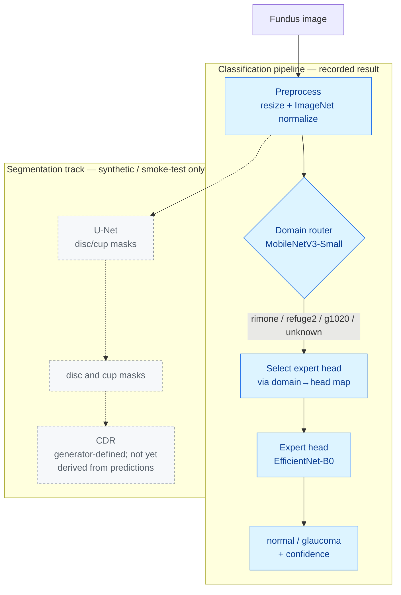
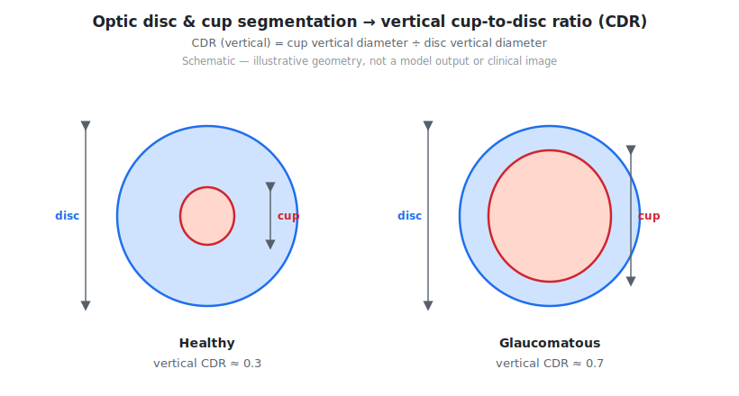
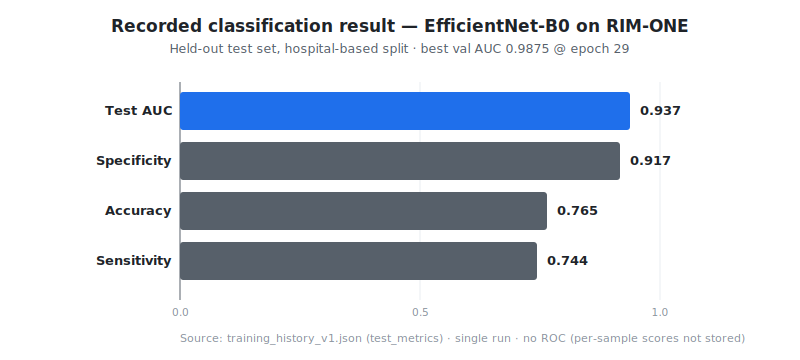
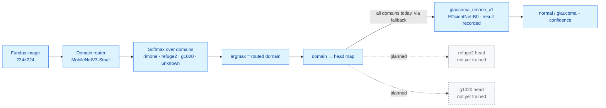
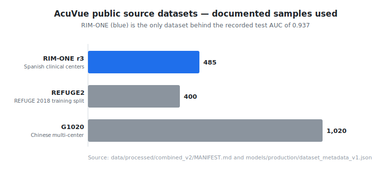

# AcuVue

**A research system for glaucoma screening from retinal fundus images.** AcuVue
takes a single colour fundus photograph and produces a *normal vs. glaucoma*
classification, with a lightweight **domain router** that selects a
dataset-specific expert model before inference. A separate, earlier-stage track
implements optic **disc / cup segmentation**, the basis for the cup-to-disc
ratio (CDR) used in clinical glaucoma assessment.

> **Status:** research / educational software. **Not a medical device**, not
> validated for clinical use, and carrying **no regulatory clearance**. The
> results below come from public-dataset experiments, not prospective clinical
> validation. See [Limitations](#limitations).

---

## At a glance

| | |
|---|---|
| **Input** | One RGB fundus image (any common format; resized to 224×224 for classification, 512×512 for segmentation) |
| **Primary output** | Binary class `normal` / `glaucoma` + confidence, plus the routed domain and the expert head used |
| **Segmentation output** | Optic-disc and optic-cup masks (U-Net); CDR is defined by these masks (see note below) |
| **Models** | EfficientNet-B0 glaucoma classifier · MobileNetV3-Small domain router · 3-level U-Net (disc/cup) |
| **Architecture research track** | Backbone grammar (EfficientNet / ConvNeXt / DeiT) × fusion modules (FiLM / cross-attention / gated / late) for image + clinical-indicator fusion |
| **Recorded result** | **Test AUC 0.937** — glaucoma classification, EfficientNet-B0, **RIM-ONE only (485 images)**, hospital-based split (details below) |
| **Config** | Hydra / OmegaConf YAML |
| **Trained weights** | **Not committed** and no download URL is configured yet — see [Pretrained inference](#pretrained-inference) |

The classification pipeline is the part with a **recorded, artifact-backed
result**. The segmentation track currently runs on **synthetic and smoke-test
data** and has no committed accuracy metrics; it is documented honestly as such.

---

## System overview



*Solid path = the domain-routed classifier with a recorded test result.
Dashed path = the disc/cup segmentation track, currently exercised only on
synthetic and dummy data. Preprocessing is shared; the router and expert head
are separate models. Today a single trained expert head (RIM-ONE) exists, so all
domains map to it (see [Domain routing](#domain-routing-and-multi-head-architecture)).*

---

## The medical-imaging task

Glaucoma is an optic-neuropathy in which the optic **cup** enlarges relative to
the optic **disc**. The vertical **cup-to-disc ratio (CDR)** — the cup's vertical
diameter divided by the disc's vertical diameter — is a standard structural
indicator: healthy eyes typically sit lower, glaucomatous eyes higher.



*Schematic definition of vertical CDR — illustrative geometry, **not** a model
output or a clinical image. AcuVue approaches the problem two ways: (1) direct
image **classification** of `normal` vs `glaucoma`, and (2) **segmentation** of
the disc and cup regions that CDR is computed from.*

> **CDR note (honest scope):** the segmentation model outputs disc and cup masks,
> and the synthetic data generator *parameterizes* CDR when it creates examples.
> The repository does **not** yet include code that derives CDR from a *predicted*
> mask, so CDR is not currently a pipeline output. This is listed under
> [Reproducibility levels](#reproducibility-levels) as future work rather than a
> shipped capability.

---

## End-to-end workflow

**Inference (classification, the recorded path):**

1. Load a fundus image.
2. Preprocess: resize to 224×224, ImageNet normalization.
3. **Domain router** (MobileNetV3-Small) predicts the source domain
   (`rimone`, `refuge2`, `g1020`, `unknown`).
4. The pipeline maps the domain to an **expert head** and selects it (falling
   back to the default head when the mapped head is not loaded).
5. The **expert head** (EfficientNet-B0) predicts `normal` / `glaucoma` with a
   confidence score.
6. The result carries the prediction, probabilities, routed domain, and the head
   used.

**Segmentation (research track):** a 3-level U-Net maps a 512×512 fundus image
to a disc/cup mask (sigmoid output), trained with a BCE + Dice objective. It is
currently demonstrated on **synthetic** fundus images and dummy smoke-test data.

---

## Prediction example

A reproducible **synthetic** demonstration of the segmentation target — original
fundus, disc mask, cup mask, overlay, and the resulting vertical CDR — can be
generated locally (no downloads, no GPU, no trained weights):

```bash
python scripts/visualization/generate_segmentation_demo.py --seed 42
# -> docs/images/segmentation-demo.png
```

<!--
segmentation-demo.png is intentionally NOT committed: it is produced by executing
the repository's synthetic generator, and this documentation pass was prepared in
an environment where the project code could not be run. Regenerate it locally
with the command above (requires numpy, opencv-python, matplotlib). The figure is
a synthetic demonstration of the disc/cup task and CDR — not a clinical result
and not a prediction from a trained model.
-->

A real end-to-end **prediction** figure (fundus → predicted masks / class →
ground truth) is **not** included because the trained checkpoints and the
clinical images are not committed (see [Pretrained inference](#pretrained-inference)
and [Reproducibility levels](#reproducibility-levels)).

---

## Results

The one result with a committed, machine-readable artifact behind it is the
production **glaucoma classifier**:



| Metric | Value | Meaning |
|---|---:|---|
| **Test AUC** | **0.937** | Ranking quality, held-out test set |
| Test accuracy | 0.765 | Fraction correct |
| Test sensitivity (recall) | 0.744 | Glaucoma cases correctly flagged |
| Test specificity | 0.917 | Normal cases correctly cleared |
| Best validation AUC | 0.9875 | At epoch 29 of 30 |

**Exactly what this measures — and what it does not:**

- **Task:** binary classification (`normal` vs `glaucoma`) from the fundus image
  — **not** segmentation and **not** a CDR measurement.
- **Model:** EfficientNet-B0 (timm), ImageNet-pretrained, 224×224 input.
- **Dataset:** **RIM-ONE only — 485 images.** It is **not** the combined
  1,905-image set, and the run did **not** use domain adaptation. (An earlier
  README described "0.93 AUC on RIM-ONE + REFUGE + G1020 across 1,905 images with
  domain adaptation"; that conflated two separate things and is corrected here —
  see [Datasets](#datasets-and-preprocessing).)
- **Split:** **hospital-based (institution-level).** Train/validation come from
  hospitals `r2` + `r3` (330 train, 57 val); the held-out test set is hospital
  `r1` (98 images). No hospital appears in both train and test.
- **Why hospital-based matters:** a random image-level split on RIM-ONE reaches
  ~97% AUC by learning per-hospital acquisition signatures — data leakage. The
  hospital-based split removes that shortcut, and 0.937 is the more honest
  number. See [`docs/HOSPITAL_BASED_SPLITTING.md`](docs/HOSPITAL_BASED_SPLITTING.md).
- **Provenance:** recorded in
  [`models/production/training_history_v1.json`](models/production/training_history_v1.json)
  (`test_metrics`), with dataset counts in
  [`models/production/dataset_metadata_v1.json`](models/production/dataset_metadata_v1.json)
  and the run configuration in
  [`configs/production_training_v1.yaml`](configs/production_training_v1.yaml).
- **Reproducibility:** this is a **recorded historical result**. It is **not**
  reproducible from a clean clone: the checkpoint is not committed, no download
  URL is configured, and RIM-ONE must be obtained separately and preprocessed.
  It is regenerable only by re-running training on RIM-ONE (single run; no
  repeated-seed variance is recorded).

No ROC curve is shown: the artifact stores summary metrics, not per-sample
scores, so a faithful ROC/confusion matrix cannot be reconstructed.

**Segmentation results:** none are recorded. The U-Net has Dice/IoU metric code
([`src/evaluation/metrics.py`](src/evaluation/metrics.py)) but no committed
Dice/IoU numbers on real data; it has only been exercised on synthetic/dummy
data.

---

## Domain routing and multi-head architecture



**How routing works (as implemented):**

- The router is a **learned** classifier (MobileNetV3-Small, ~2.5M params). Its
  job is *not* diagnosis — it predicts which dataset family (acquisition domain)
  an image came from. It is defined with **4 classes**
  (`rimone`, `refuge2`, `g1020`, `unknown`); the training config
  ([`configs/router_training_v1.yaml`](configs/router_training_v1.yaml)) trains
  over the 3 known domains.
- Routing is **hard** (`argmax` over the softmax), then a static
  **domain → head map** selects the expert
  ([`src/inference/head_registry.py`](src/inference/head_registry.py)).
- **Fallback:** if the mapped head is not loaded, the pipeline falls back to the
  first available head
  ([`src/inference/pipeline.py`](src/inference/pipeline.py)).
- **Ensemble mode** (`predict_with_ensemble`) averages probabilities across
  multiple heads for uncertain cases.
- **Current reality:** only **one** expert head is registered
  (`glaucoma_rimone_v1`, the RIM-ONE model). Every domain — including `refuge2`
  and `g1020` — currently maps to it as a fallback. Per-domain heads are
  scaffolded (commented placeholders) but not yet trained. Neither the router
  weights nor the head weights are committed, so end-to-end routing requires
  training or supplying those weights.

Full design notes: [`docs/MULTI_HEAD_ARCHITECTURE.md`](docs/MULTI_HEAD_ARCHITECTURE.md).

---

## Model architecture and fusion strategies

Three families of models are implemented:

**1. Glaucoma classifier (production path).** EfficientNet-B0 (timm), ImageNet
pretrained, `Dropout(0.3) → Linear(1280, 2)`. This is the model behind the 0.937
result. Wrapped for inference by `GlaucomaPredictor`
([`src/inference/predictor.py`](src/inference/predictor.py)).

**2. Disc/cup segmentation.** A compact 3-level U-Net with skip connections,
sigmoid mask output, BCE + Dice objective
([`src/models/unet_disc_cup.py`](src/models/unet_disc_cup.py)).

**3. Architecture-grammar research track.** A model factory
([`src/models/model_factory.py`](src/models/model_factory.py)) composes a
backbone with a fusion module to build a multimodal classifier that fuses image
features with clinical indicators:

| Backbones ([`backbones.py`](src/models/backbones.py)) | Fusion modules ([`fusion_modules.py`](src/models/fusion_modules.py)) |
|---|---|
| EfficientNet-B0…B7 | **FiLM** — feature-wise linear modulation |
| ConvNeXt Tiny / Small / Base | **Cross-attention** — clinical queries attend to image features |
| DeiT Tiny / Small / Base (ViT) | **Gated** — learned per-sample weighting |
| | **Late** — pooled concatenation baseline |

These combinations are unit-tested for shape and gradient flow
([`src/models/tests/test_architectures.py`](src/models/tests/test_architectures.py)),
but the **recorded 0.937 result uses the plain EfficientNet-B0 classifier, not a
fusion model.** The fusion grammar is research scaffolding, not the production
model.

Also present as reusable components (not part of the recorded run): domain-
adversarial training (gradient reversal), curriculum learning across datasets,
and custom losses (weighted BCE, asymmetric focal, AUC-surrogate, DRI
attention-regularization).

---

## Datasets and preprocessing

AcuVue references three public fundus datasets. **None are committed** (raw and
processed data are git-ignored); each must be obtained from its source under its
own license.



| Dataset | Documented samples used | Role | Access |
|---|---:|---|---|
| **RIM-ONE r3** | 485 | **Behind the recorded 0.937 result** | External download + preprocessing |
| REFUGE2 | 400 (train split only) | Domain routing / combined set | External; val/test labels are competition holdouts |
| G1020 | 1,020 | Domain routing / combined set | External download |

**Two different dataset views — do not conflate them:**

1. **RIM-ONE, hospital-split (the recorded classification result).** 485 images,
   split by hospital to prevent leakage
   ([`dataset_metadata_v1.json`](models/production/dataset_metadata_v1.json)):

   | Split | Hospitals | Images | Normal | Glaucoma |
   |---|---|---:|---:|---:|
   | Train | r2, r3 | 330 | 189 | 141 |
   | Val | r2, r3 | 57 | 38 | 19 |
   | Test | **r1** | 98 | 86 | 12 |
   | **Total** | | **485** | 313 | 172 |

2. **`combined_v2` — a separate 1,905-image preprocessing experiment**
   ([MANIFEST](data/processed/combined_v2/MANIFEST.md)): RIM-ONE + REFUGE2 +
   G1020, image-level split (1,394 train / 132 val / 379 test), 73.3% normal /
   26.7% glaucoma. This set was built to study preprocessing (e.g. removing CLAHE
   and adding ImageNet normalization). **It has no recorded AUC** and is *not* the
   dataset behind the 0.937 number.

**Preprocessing:** BGR→RGB, resize (512×512 for segmentation, 224×224 for the
classifier), pixel scaling to [0, 1], optional ImageNet normalization. CLAHE was
implemented earlier and later removed as incompatible with ImageNet-pretrained
transfer learning. Details:
[`docs/preprocessing_pipeline.md`](docs/preprocessing_pipeline.md).

---

## Evaluation methodology

- **Classification metrics** — accuracy, sensitivity, specificity, precision, F1,
  and AUC (via scikit-learn) in
  [`src/evaluation/metrics.py`](src/evaluation/metrics.py).
- **Segmentation metrics** — Dice, IoU, pixel accuracy, sensitivity/specificity
  in the same module (used by the segmentation training scripts; no results
  committed).
- **Leakage control** — institution-level (hospital-based) splitting is the
  recommended protocol for RIM-ONE; see
  [`src/data/hospital_splitter.py`](src/data/hospital_splitter.py) and
  [`docs/HOSPITAL_BASED_SPLITTING.md`](docs/HOSPITAL_BASED_SPLITTING.md).
- **Cross-dataset evaluation** — a `CrossDatasetEvaluator`
  ([`src/evaluation/cross_dataset_evaluator.py`](src/evaluation/cross_dataset_evaluator.py))
  measures per-dataset AUC and domain-shift drop (requires the datasets).

---

## Installation

```bash
git clone https://github.com/1quantlogistics-ship-it/AcuVue.git
cd AcuVue
python -m venv .venv
source .venv/bin/activate          # Windows: .venv\Scripts\activate
pip install -r requirements.txt
```

Requires Python 3.9+ and PyTorch 2.0+. A GPU is optional for the smoke tests and
inference; it is recommended for training.

---

## Fastest verification path (smoke test)

This checks that the environment and core code paths work. It uses synthetic /
dummy data only and verifies **execution, not clinical performance**.

```bash
# 1. Verify the environment (imports, a U-Net forward pass, dummy data)
python scripts/verify_phase01.py

# 2. Generate a synthetic fundus dataset (deterministic; no downloads)
python src/data/synthetic_fundus.py            # -> data/synthetic/

# 3. Run the segmentation smoke test (Hydra config: phase01_smoke_test, dummy data)
python src/training/train_segmentation.py
```

---

## Pretrained inference

> **Currently blocked from a clean clone.** The trained weights
> (`glaucoma_efficientnet_b0_v1.pt`, `domain_classifier_v1.pt`) are **not
> committed**, and `scripts/download_weights.py` has **placeholder URLs
> (`None`)** — so `--all` reports "no URL configured" and downloads nothing. To
> run real inference you must supply weights (retrain, or place a checkpoint at
> the expected path) and then load the pipeline.

Intended API once weights are present:

```python
from src.inference.pipeline import MultiHeadPipeline

pipeline = MultiHeadPipeline.from_config("configs/pipeline_v1.yaml")
result = pipeline.predict("path/to/fundus.png")
print(result.prediction, result.confidence)      # e.g. glaucoma 0.87
print(result.routed_domain, "->", result.head_used)
```

Expected checkpoint locations:
`models/production/glaucoma_efficientnet_b0_v1.pt` and
`models/routing/domain_classifier_v1.pt`.

---

## Training

Real-data training requires obtaining and preprocessing the datasets (they are
not committed).

```bash
# Segmentation baseline on synthetic data (Hydra config: phase02_baseline)
python src/training/train_phase02.py

# Domain router (argparse; needs processed per-domain data listed in the config)
python src/training/train_router.py --config configs/router_training_v1.yaml
```

**Classifier training — known gap.** The production run is documented by
[`configs/production_training_v1.yaml`](configs/production_training_v1.yaml), but
[`src/training/train_classification.py`](src/training/train_classification.py) is
a Hydra entry point whose default config name (`phase03_classification`) is **not
present** in `configs/`. As committed, the classifier training command does not
run without adding that config (or adapting the script to
`production_training_v1.yaml`). This is recorded under
[Reproducibility levels](#reproducibility-levels).

---

## Configuration

Training and inference are configured with Hydra / OmegaConf YAML in
[`configs/`](configs/):

| File | Purpose |
|---|---|
| `phase01_smoke_test.yaml` | 1-epoch U-Net smoke test on dummy data |
| `phase02_baseline.yaml` | 10-epoch segmentation baseline (synthetic) |
| `phase03e.yaml` | Preprocessing/normalization experiment (`combined_v2`) |
| `router_training_v1.yaml` | Domain-router training |
| `production_training_v1.yaml` | Documents the recorded RIM-ONE classifier run |
| `pipeline_v1.yaml` | Multi-head inference pipeline (router + heads) |

Hydra entry points accept command-line overrides, e.g.:

```bash
python src/training/train_phase02.py training.epochs=20 training.batch_size=8
```

---

## Testing

The suite lives in [`tests/`](tests/) (unit + integration) plus
[`src/models/tests/`](src/models/tests/). Tests are designed to run **standalone**
on synthetic data, mocks, and temporary random-weight checkpoints; tests that
need trained weights or clinical data **skip gracefully**.

```bash
pytest tests/ -v
```

> These tests were **not executed** while preparing this documentation (the
> project was set up to run on a separate VM, not the environment used for the
> docs pass), so no pass/fail claim is made here. Test *design* was reviewed from
> source: e.g. [`test_domain_router.py`](tests/unit/test_domain_router.py),
> [`test_multi_head_pipeline.py`](tests/unit/test_multi_head_pipeline.py), and
> [`test_routing_pipeline.py`](tests/integration/test_routing_pipeline.py) build
> their own fixtures and do not download anything.

---

## Reproducing the documentation visuals

The analytical figures are regenerated by scripts under
[`scripts/visualization/`](scripts/visualization/). They read only committed
artifacts (or the repository's synthetic generator), use a non-interactive
backend, and write into `docs/images/`:

```bash
python scripts/visualization/generate_dataset_summary.py     # dataset-distribution.svg
python scripts/visualization/generate_evaluation_summary.py  # evaluation-summary.svg
python scripts/visualization/generate_segmentation_demo.py --seed 42  # segmentation-demo.png
```

Provenance for every image (source artifact, hand-authored vs script-generated,
synthetic vs clinical) is in [`docs/VISUALS.md`](docs/VISUALS.md).

---

## Repository structure

```
AcuVue/
├── src/
│   ├── data/          # datasets, synthetic generator, hospital/leakage-aware splitting, preprocessing
│   ├── models/        # U-Net, backbones, fusion modules, model factory, classifier
│   ├── routing/       # domain classifier + DomainRouter
│   ├── training/      # segmentation, classification, router, curriculum, losses, domain adaptation
│   ├── evaluation/    # Dice/IoU/AUC metrics, cross-dataset + DRI evaluators
│   ├── inference/     # GlaucomaPredictor, multi-head pipeline, head/model registries, batch processor
│   └── utils/         # checkpoint helpers
├── configs/           # Hydra YAML configs
├── docs/              # architecture, preprocessing, splitting docs + images/ and VISUALS.md
├── models/            # production/ + routing/ metadata + READMEs (weights NOT committed)
├── scripts/           # weight download (placeholder URLs), validation, visualization/
└── tests/             # unit + integration tests
```

---

## Reproducibility levels

An explicit map of what a reader can expect to run, and what they cannot:

| Capability | Level | Notes |
|---|---|---|
| Synthetic fundus generation | ✅ Runs from clean clone | Deterministic (`seed=42`), no downloads |
| U-Net forward pass + segmentation smoke test | ✅ Runs from clean clone | Dummy data; verifies execution only |
| Architecture grammar (backbones × fusion) | ✅ Runs from clean clone | Shape/gradient unit tests |
| Router / pipeline / predictor logic | ✅ Runs from clean clone | Random-weight & mock fixtures |
| Documentation visuals (dataset, evaluation, seg-demo) | ✅ Runs from clean clone | Reads committed artifacts / synthetic generator |
| **0.937 classification result** | 🟠 Recorded artifact | In `training_history_v1.json`; regenerable only with RIM-ONE + retraining |
| Real pretrained inference | 🔴 Blocked | Weights not committed; download URLs are placeholders |
| Real-data training (any dataset) | 🔴 External data required | Datasets git-ignored; obtain + preprocess separately |
| Classifier training entry point | 🔴 Config gap | Default Hydra config `phase03_classification` missing (see [Training](#training)) |
| CDR derived from predicted masks | ⚪ Not implemented | Future work; CDR exists only as a synthetic-generation parameter |
| Per-domain expert heads (refuge2, g1020) | ⚪ Planned | Scaffolded; all domains currently fall back to the RIM-ONE head |

Legend: ✅ runnable · 🟠 recorded (needs data/retrain) · 🔴 blocked without
external assets · ⚪ planned / not implemented.

---

## Limitations

- **Research/educational only. Not a medical device.** No regulatory clearance
  (FDA/CE or otherwise) is claimed or implied.
- Segmentation and CDR do **not** by themselves establish a diagnosis; qualified
  clinical interpretation is required.
- The recorded result is a **single run** on **one dataset** (RIM-ONE, 485
  images) with a **small held-out test set (98 images, only 12 glaucoma)** — wide
  confidence intervals; treat 0.937 as indicative, not definitive.
- Public-dataset evaluation is **not** prospective clinical validation.
  Performance can vary with camera/device, population, image quality, and
  annotation protocol.
- Cross-domain generalization is unproven: only the RIM-ONE head is trained, and
  images from other domains currently route to it by fallback.
- No calibration, uncertainty quantification, fairness, or subgroup analysis is
  provided.

---

## Security and privacy

- **No patient data is included** in this repository. Raw and processed image
  directories are git-ignored; only synthetic data and small JSON/Markdown
  metadata are tracked.
- The public datasets carry their own licenses and usage terms — review them
  before downloading or redistributing. AcuVue does not relicense them.
- Do not commit clinical images, PHI, or trained weights derived from restricted
  data to this repository.

---

## Additional documentation

- [`docs/MULTI_HEAD_ARCHITECTURE.md`](docs/MULTI_HEAD_ARCHITECTURE.md) — router + expert-head design
- [`docs/HOSPITAL_BASED_SPLITTING.md`](docs/HOSPITAL_BASED_SPLITTING.md) — leakage control and why random splits inflate AUC
- [`docs/INFERENCE_PIPELINE_V2.md`](docs/INFERENCE_PIPELINE_V2.md) — inference API
- [`docs/preprocessing_pipeline.md`](docs/preprocessing_pipeline.md) — preprocessing details
- [`docs/VISUALS.md`](docs/VISUALS.md) — provenance of every README image
- [`CHANGELOG.md`](CHANGELOG.md) — version history

---

## License

MIT (see repository). Source datasets and any trained weights are governed by
their own licenses and terms, which are not superseded by this repository's
license.
